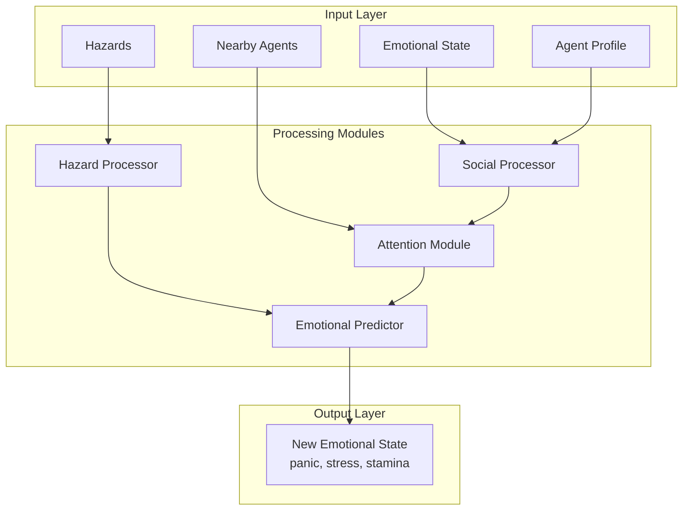
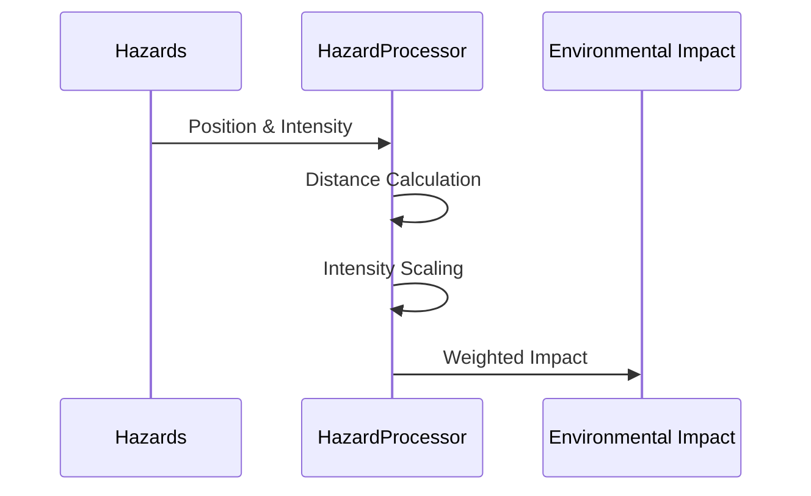
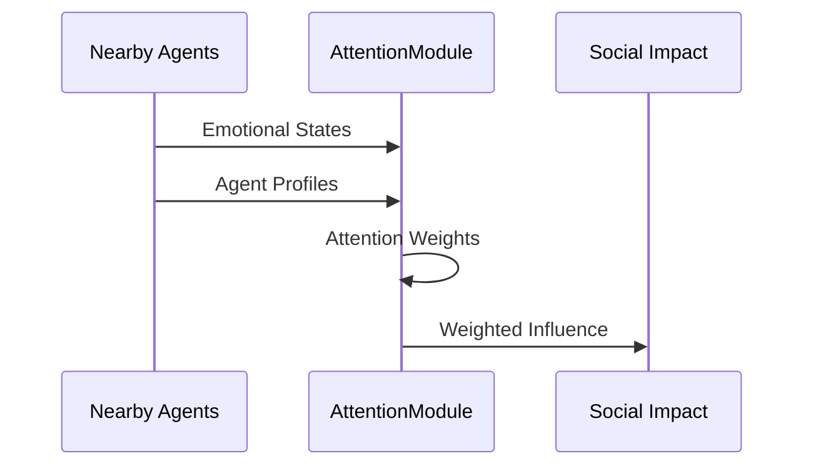
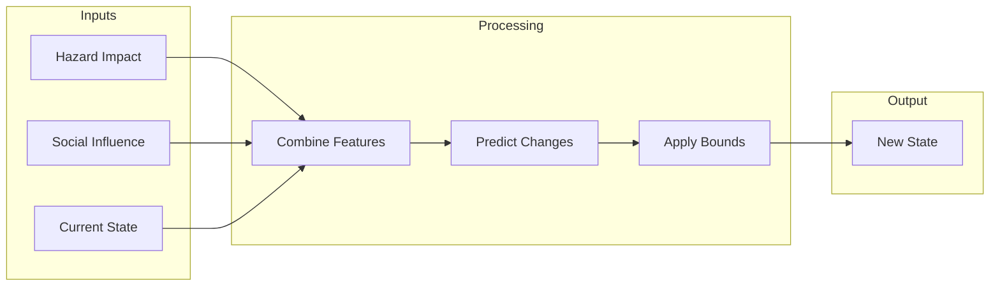

# Emotional Neural Network Documentation

## Overview
The Emotional Neural Network (ENN) simulates human emotional dynamics in emergency evacuation scenarios. It processes individual and social emotional states while considering environmental hazards and personality traits.

## Architecture

### Core Components


### Data Structures

#### EmotionalState
```python
@dataclass
class EmotionalState:
    panic: float    # [0.0 - 1.0]
    stress: float   # [0.0 - 1.0]
    stamina: float  # [0.0 - 1.0]
```

#### AgentProfile
```python
@dataclass(frozen=True)
class AgentProfile:
    base_panic_threshold: float    # Base panic activation
    social_influence: float        # Social susceptibility
    helping_tendency: float        # Altruistic behavior
    decision_speed: float         # Action timing
    risk_aversion: float          # Threat sensitivity
    emotional_stability: float    # Recovery rate
    leadership_score: float       # Influence on others
```

## Processing Pipeline

### 1. Hazard Processing


### 2. Social Influence


### 3. Emotional Update


## Usage

### Initialization
```python
config = {
    'emotional': {
        'network': {
            'hidden_size': 128,
            'num_attention_heads': 4,
            'dropout': 0.1
        }
    },
    'environment': {
        'max_nearby_agents': 10,
        'max_hazards': 5
    }
}

network = EmotionalNetwork(config)
```

### Forward Pass
```python
# Prepare inputs
current_state = torch.tensor([0.2, 0.3, 0.9])  # [panic, stress, stamina]
agent_profile = torch.tensor([0.7, 0.5, 0.6, 0.8, 0.4, 0.6, 0.3])
nearby_agents = (
    emotional_states_tensor,  # [batch_size, max_agents, 3]
    profile_tensor           # [batch_size, max_agents, 7]
)
hazards = hazards_tensor    # [batch_size, max_hazards, 3]

# Process emotional update
new_state = network(
    current_state,
    agent_profile,
    nearby_agents,
    hazards,
    delta_time=0.1
)
```

## Safety Mechanisms

### Bounds
```python
@dataclass
class SafetyBounds:
    max_panic_increase: float = 0.3    # Maximum panic change per step
    max_stress_increase: float = 0.2   # Maximum stress change per step
    min_stamina: float = 0.1          # Minimum stamina level
    max_social_influence: float = 0.5  # Maximum social impact
    max_hazard_impact: float = 0.4     # Maximum hazard effect
```

### Stability Controls
1. Time-based decay
2. Profile-based modulation
3. Change rate limiting
4. Minimum guarantees

## Performance Optimization

### Memory Management
```python
# Pre-allocated buffers
self.register_buffer('attention_mask', torch.ones(1, self.max_agents))
self.register_buffer('agent_indices', torch.arange(self.max_agents))
self.register_buffer('distance_scale', torch.tensor([1.0, 1.0, 0.5]))
```

### Computational Efficiency
1. JIT compiled methods
2. Batched processing
3. In-place operations
4. Cached computations

## Debugging and Analysis

### Activation Tracking
```python
network.debug_mode = True
# Run forward pass
activations = network.activation_history[-1]
print(f"Hazard impact: {activations.hazard_features.mean()}")
print(f"Social influence: {activations.social_features.mean()}")
```

### Performance Monitoring
```python
with torch.profiler.profile() as prof:
    new_state = network(current_state, agent_profile, nearby_agents, hazards, 0.1)
print(prof.key_averages().table())
```

## Integration Example

```python
class EvacuationAgent:
    def __init__(self, emotional_net: EmotionalNetwork, ...):
        self.emotional_net = emotional_net
        self.emotional_state = EmotionalState.create_initial()
    
    def update(self, observation: Dict[str, torch.Tensor]) -> None:
        # Update emotional state
        new_state = self.emotional_net(
            self.emotional_state.to_tensor(self.device),
            self.profile.to_tensor(self.device),
            observation['nearby_agents'],
            observation['hazards'],
            self.config['time_step']
        )
        
        # Update state
        self.emotional_state = EmotionalState(
            panic=new_state[0].item(),
            stress=new_state[1].item(),
            stamina=new_state[2].item()
        )
```